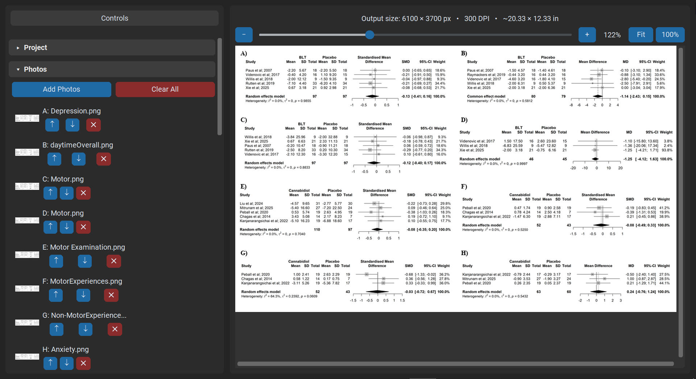

# Figora

**Combine multiple photos into a single labeled figure for manuscripts, posters, and presentations.**




Figora is a desktop app for arranging photos, micrographs, or other panel images into a single publication-ready grid figure — with panel labels (A, B, C…), consistent spacing and sizing, an optional scale bar, and export to PNG, TIFF, JPEG, or PDF at a controlled DPI.

## Contents

- [Download](#download)
- [Features](#features)
- [Requirements](#requirements)
- [Install & Run from Source](#install--run-from-source)
- [Quick Start](#quick-start)
- [Keyboard Shortcuts](#keyboard-shortcuts)
- [Saving & Loading Projects](#saving--loading-projects)
- [Building the Standalone Executables](#building-the-standalone-executables)
- [Contributing](#contributing)
- [License](#license)
- [Author](#author)

## Download

Pre-built, standalone versions of Figora — no Python installation required — are published on the [Releases](https://github.com/asmpro7/figora/releases) page.

| Platform | Download |
|---|---|
| 🪟 Windows (x64) | [figora-windows-x64.exe](https://github.com/asmpro7/figora/releases/latest/download/figora-windows-x64.exe) |
| 🍎 macOS (Intel) | [figora-macos-x64.zip](https://github.com/asmpro7/figora/releases/latest/download/figora-macos-x64.zip) |
| 🍎 macOS (Apple Silicon) | [figora-macos-arm64.zip](https://github.com/asmpro7/figora/releases/latest/download/figora-macos-arm64.zip) |
| 🐧 Linux (x64) | [figora-linux-x64](https://github.com/asmpro7/figora/releases/latest/download/figora-linux-x64) |

These links always resolve to the latest release once one is published. Figora bundles its own Python runtime, so nothing else needs to be installed.

**First run:**
- **Windows** — SmartScreen may warn the app is unrecognized (it isn't code-signed). Click **More info → Run anyway**.
- **macOS** — Unzip, then right-click (Control-click) `Figora.app` and choose **Open** the first time, since the app isn't notarized. If macOS still blocks it, allow it under **System Settings → Privacy & Security**.
- **Linux** — Make it executable first: `chmod +x figora-linux-x64 && ./figora-linux-x64`

## Features

- **Flexible grid layout** — set rows/columns manually or auto-fit rows to your photo count; fill the grid by row or by column
- **Live, accurate, zoomable preview** — what you see is what gets saved; pan by click-drag, zoom with the scroll wheel/+−/slider up to 300%, or double-click to fit
- **Panel labels** — A/B/C, a/b/c, 1/2/3, or your own custom text, in four formats (`A`, `A.`, `(A)`, `A)`) and five positions (above the panel, or any inside corner)
- **Robust font handling** — pick a common family or browse for any `.ttf`/`.otf` file; falls back to a real scalable system font even if your exact choice isn't installed, so label size always works
- **Panel borders**, **grayscale conversion**, and **auto-contrast** adjustment
- **Figure-wide caption/title**, above or below the whole grid
- **Calibrated scale bar** — give a length in source-photo pixels and Figora scales it correctly for each panel's individual resize factor
- **Background color or transparency** (PNG)
- **Export to PNG, TIFF (LZW-compressed), JPEG, or PDF**, with DPI control and optional resizing to an exact output width
- **Project save/load** (`.json`) to save and resume a layout later
- **Reorder, remove, or add photos** anytime, with live thumbnails; labels always follow list order

## Requirements

Only needed if running from source — the standalone downloads above need nothing installed.

- Python 3.9+
- `tkinter` (bundled with the standard Windows/macOS Python installers; see below for Linux)
- [customtkinter](https://github.com/TomSchimansky/CustomTkinter) and [Pillow](https://python-pillow.org/) — see `requirements.txt`

## Install & Run from Source

```bash
git clone https://github.com/asmpro7/figora.git
cd figora
pip install -r requirements.txt
python figora.py
```

`tkinter` ships with Python on Windows and macOS. On Linux, if you get `ModuleNotFoundError: No module named 'tkinter'`, install it separately:

```bash
sudo apt install python3-tk        # Debian/Ubuntu
sudo dnf install python3-tkinter   # Fedora
```

## Quick Start

1. **Add Photos** — click **Add Photos** (or the button in the empty preview) and select your images.
2. **Arrange the grid** — expand **Grid & Spacing** to set columns (rows auto-fit by default), spacing, margin, panel size, and fill order (by row or by column).
3. **Label the panels** — expand **Panel Labels** to choose a style, format, position, and font.
4. **Polish it** — optionally add a border, convert to grayscale, add a figure caption, or a calibrated scale bar.
5. **Export** — pick a format (PNG by default) and DPI under **Output**, then **Save Figure**. The confirmation dialog can open the file or its folder directly.

Reorder photos anytime with the ↑ / ↓ buttons in the photo list — panel labels always follow that order, regardless of grid fill direction.

## Keyboard Shortcuts

| Shortcut | Action |
|---|---|
| `Ctrl+O` | Add photos |
| `Ctrl+S` | Save figure |
| `Ctrl+=` / `Ctrl+-` | Zoom preview in / out |
| `Ctrl+0` | Reset preview zoom to 100% |
| Double-click preview | Zoom to fit |

## Saving & Loading Projects

Under **Project**, **Save Project…** writes a `.json` file with your full layout (photo file paths and every setting). **Load Project…** restores it later — useful for a figure you'll revisit, or as a starting template for a similar one. Photos are referenced by file path, so keep the originals in place; Figora will list any it can't find when loading.

## Building the Standalone Executables

The downloads above are built with [PyInstaller](https://pyinstaller.org/). PyInstaller doesn't cross-compile — build on each target OS separately (a Windows `.exe` must be built on Windows, a macOS app on macOS, and so on). A CI matrix (e.g. GitHub Actions with `windows-latest`, `macos-13` for Intel, `macos-14` for Apple Silicon, and `ubuntu-latest` runners) is the usual way to produce all four from one commit.

```bash
pip install pyinstaller
pip install -r requirements.txt
```

customtkinter ships its theme and font files as package *data*, which PyInstaller doesn't pick up automatically — `--collect-all customtkinter` is required, or the built app will fail on startup looking for its theme file.

**Windows:**
```bash
pyinstaller --noconfirm --onefile --windowed --name figora-windows-x64 --collect-all customtkinter figora.py
```
Produces `dist\figora-windows-x64.exe`.

**macOS** (run once on an Intel Mac, once on Apple Silicon):
```bash
pyinstaller --noconfirm --onefile --windowed --name Figora --collect-all customtkinter figora.py
```
Produces `dist/Figora.app`.

**Linux:**
```bash
pyinstaller --noconfirm --onefile --windowed --name figora-linux-x64 --collect-all customtkinter figora.py
```
Produces `dist/figora-linux-x64`.

## Contributing

Issues and pull requests are welcome. For larger changes, please open an issue first to discuss what you'd like to change.

## License

This project is licensed under the **GNU General Public License v3.0 (GPL-3.0)**.

You are free to use, study, modify, and distribute this software under the terms of the GPL-3.0 license. Any derivative work or redistribution must also be licensed under GPL-3.0 and include the corresponding source code as required by the license.

For the full license text, see the `LICENSE` file in this repository or visit the GNU GPL v3.0 license page.

## Author

**Ahmed Abdelmageed**

- GitHub: [@asmpro7](https://github.com/asmpro7)
- ORCID: [0009-0002-7902-690X](https://orcid.org/0009-0002-7902-690X)
- LinkedIn: [asmpro](https://www.linkedin.com/in/asmpro/)
- Email: [AhmedElSaeedMassad@gmail.com](mailto:AhmedElSaeedMassad@gmail.com)
